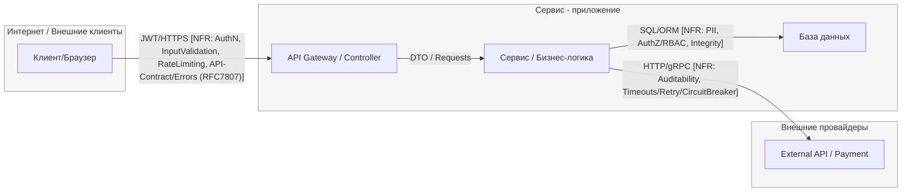

# TM - Требования безопасности + Модель угроз + ADR

> Этот файл - **индивидуальный**. Его проверяют по **rubric_TM.md** (5 критериев × {0/1/2} → 0-10).
> Подсказки помечены `TODO:` - удалите после заполнения.
> Все доказательства/скрины кладите в **EVIDENCE/** и ссылайтесь на конкретные файлы/якоря.

---

## 0) Мета

- **Проект (опционально BYO):** «учебный шаблон»
- **Версия (commit/date):** 2025-10-13
- **Кратко (1-2 предложения):** «учебный шаблон»

---

## 1) Архитектура и границы доверия (TM1, S04)

- **Роли/активы:** end user, admin, tenant manager.
- **Trust Zones:**
  - **Internet:** public clients (browsers, REST calls).
  - **DMZ:** API Gateway (auth, rate limiting).
  - **Internal:** services and databases (RBAC, business logic).
  - **External:** third-party payment API.
- **Context/DFD:**

- **Критичные интерфейсы и допущения:**  
  - Internet → API: untrusted zone; requires AuthN, InputValidation, RateLimiting.
  - Service → DB: trusted, protected via RBAC and integrity constraints.
  - Service → External API: partially trusted; requires timeout and circuit breaker.
  - Admin path: limited to internal roles with audit logging.

---

## 2) Реестр угроз STRIDE (TM2, TM3, S04)

| ID | STRIDE | Component / Flow | Threat (short) | L | I | L×I |
|----|---------|------------------|----------------|---|---|----|
| R-01 | S | Internet → API | Token reuse / JWT spoofing | 4 | 4 | 16 |
| R-02 | T | Internet → API | Dirty or oversized payload | 3 | 4 | 12 |
| R-03 | D | Internet → API | Brute-force / request flooding | 4 | 4 | 16 |
| R-04 | I | Service / Logs | PII leakage in logs | 3 | 4 | 12 |
| R-05 | E | Service / RBAC | Cross-tenant access | 4 | 5 | 20 |
| R-06 | T | Service → DB | SQL injection / unvalidated input | 3 | 4 | 12 |
| R-07 | R | Admin actions | No immutable audit log | 3 | 3 | 9 |
| R-08 | D | Service → External | External API hang (no timeout/retry/CB) | 4 | 4 | 16 |

---

## 3) Приоритизация и Top-5 _(TM3, S04)_

1. **R-05 (E)** – Cross-tenant RBAC bypass → 20 points (highest impact)
2. **R-01 (S)** – Token spoofing → 16 points
3. **R-03 (D)** – Brute-force abuse → 16 points
4. **R-08 (D)** – External API DoS → 16 points
5. **R-04 (I)** – PII disclosure in logs → 12 points

---

## 4) Требования (S03) и ADR-решения (S05) под Top-5 (TM4)

### NFR-001. Authentication (AuthN)
- Linked Risk: R-01
- ADR: [JWT TTL + Refresh + Rotation](../EVIDENCE/S05/S05_ADR_JWT_TTL_Refresh_Rotation.md)
- AC (GWT):
  - Given valid token → Then 200 OK and X-User-Id matches subject.
  - Given expired/stolen token → Then 401 RFC 7807.

### NFR-006. RBAC / Authorization
- Linked Risk: R-05
- ADR: [RBAC + Tenant Isolation](../EVIDENCE/S05/S05_ADR_RBAC_Tenant_Isolation.md)
- AC (GWT):
  - Given user A → When accessing tenant B data → Then 403 RFC 7807 (no leak).

### Краткие ADR - архитектурные решения S05

(карточки короткие, по делу)

#### ADR-001 - JWT TTL + Refresh + Rotation

- **Context (угрозы/NFR):** R-01, NFR-001; tokens signed with RS256; kid header supports key rotation.
- **Decision:** Adopt **short-lived access tokens** (TTL = 15 min) and **rotating refresh tokens** (TTL = 7 days) with revoke list storage. Use **RFC 7807** error format and rate-limit login/refresh endpoints.
- **Trade-offs (кратко):** Limits exposure window and enables revocation, requires revoke store and token rotation logic.
- **DoD (готовность):**   
**Given** expired or stolen token      
**When** sending request to API  
**Then** response is 401/403 RFC 7807; no sensitive info disclosed.
- **Owner:** Нгуен Дык Хю / Backend developer
- **Evidence (план/факт):**  DAST auth-flow tests

#### ADR-002 - RBAC + Tenant Isolation (deny-by-default)

- **Context:** R-05, NFR-006; Cross-tenant access, Elevation of Privilege
- **Decision:** rate-limit на GW + server-side timeouts; backpressure
- **Trade-offs:** возможные 429 и влияние на UX
- **DoD:** срабатывание 429 при >N rps; p95 ≤ T сек
- **Owner:** Фам Тиен Мань / Backend developer
- **Evidence (план/факт):** Policy tests

#### ADR-003 - Rate Limiting (≤5 req/min/IP) + 429 + Retry-After

- **Context:** R-03, NFR-003; риск злоупотребления частотой запросов (brute-force, flood)
- **Decision:** Настроить ограничение скорости на уровне API Gateway: не более 5 запросов/мин с одного IP и 20 на пользователя. При превышении возвращается HTTP 429 Too Many Requests с заголовком Retry-After (30 сек).
- **Trade-offs:** Снижает риск DoS, практически не влияет на легитимных пользователей; требует middleware Redis/NGINX.
- **DoD:**   
**Given** серия запросов > 5 в минуту с одного IP    
**When** API обрабатывает их   
**Then** возвращается 429 + Retry-After.
- **Owner:** Фам Тиен Мань / Backend developer
- **Evidence (план/факт):** Load-тест и лог rate-limiter

#### ADR-004 - Timeouts ≤2s + Retry≤3 with jitter + Circuit Breaker (50%/1m)

- **Context:** R-08, NFR-009; риск зависания внешнего API и цепной ошибки сервисов.
- **Decision:** Установить таймаут ≤ 2 с, повтор до 3 раз с экспоненциальной задержкой (jitter); Circuit Breaker открывается при ошибках ≥ 50 % за 1 минуту. Добавить метрики и логирование состояния CB.
- **Trade-offs:** Повышает устойчивость к сбоям, но увеличивает сложность конфигурации и мониторинга.
- **DoD:**   
**Given** внешний провайдер недоступен   
**When** POST /api/payment выполняется  
**Then** ожидание ≤ 6 с; CB открывается; возврат ошибки 5xx.
- **Owner:** Нгуен Дык Хю / Backend developer
- **Evidence (план/факт):** Интеграционные тесты

#### ADR-005 - Input Validation & Size Limits; reject extra fields

- **Context:** R-02, NFR-002 и NFR-004; риск грязного ввода и несоответствия схеме.
- **Decision:** Использовать валидацию JSON-схемы (DTO) и ограничение тела запроса ≤ 16 KiB; отклонять лишние или некорректные поля.
- **Trade-offs:** Гарантирует целостность данных, но требует обновления схем при изменении API.
- **DoD:**     
**Given** payload с дополнительными или повреждёнными полями    
**When** POST /api/register   
**Then** 400/413 RFC 7807, без краша.
- **Owner:** Фам Тиен Мань / Backend developer
- **Evidence (план/факт):** API тесты валидации
---

## 5) Трассировка Threat → NFR → ADR → (План)Проверки (TM5)

| Threat | NFR | ADR | Чем проверяем (план/факт) |
|-------|-------|---------|-------------------------------------------------------------------------------------------|
| R-01 (S) Token spoofing | NFR-001 | ADR-001 | DAST auth-flow tests |
| R-03 (D) Abuse / brute force | NFR-003 | ADR-003 | Load test |
| R-04 (T) PII leakage | NFR-002, NFR-004 | ADR-00 | Log inspection |
| R-05 (E) Cross-tenant | NFR-006 | ADR-002 | Policy tests |
| R-08 (D) External API DoS | NFR-009 | ADR-004 | Integration test |

---

## 6) План проверок (мост в DV/DS)

- **SAST/Secrets/SCA:** GitHub Advanced Security, Trivy, Semgrep, Gitleaks.
- **SBOM:** Syft, SPDX-JSON
- **DAST (если применимо):** OWASP ZAP `auth-flow.yaml`.
---

## 7) Самопроверка по рубрике TM (0/1/2)

- **TM1. Архитектура и границы доверия:** [ ] 0 [ ] 1 [x] 2  
- **TM2. Покрытие STRIDE и уместность угроз:** [ ] 0 [ ] 1 [x] 2  
- **TM3. Приоритизация и Top-5:** [ ] 0 [ ] 1 [x] 2  
- **TM4. NFR + ADR под Top-5:** [ ] 0 [ ] 1 [x] 2  
- **TM5. Трассировка → (план)проверок:** [ ] 0 [ ] 1 [x] 2  

**Итог TM (сумма):** 10/10
