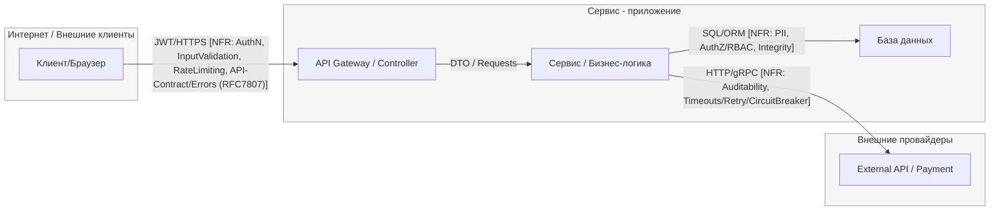

# S04 - DFD (минимальная)

```mermaid
flowchart LR
  subgraph Internet[Интернет / Внешние клиенты]
    U[Клиент/Браузер]
  end

  subgraph Service[Сервис - приложение]
    A[API Gateway / Controller]
    S[Сервис / Бизнес-логика]
    D[База данных]
  end

  subgraph External[Внешние провайдеры]
    X[External API / Payment]
  end

  U -- "JWT/HTTPS [NFR: AuthN, InputValidation, RateLimiting, API-Contract/Errors (RFC7807)]" --> A
  A -->|"DTO / Requests"| S
  S -->|"SQL/ORM [NFR: PII, AuthZ/RBAC, Integrity]"| D
  S -->|"HTTP/gRPC [NFR: Auditability, Timeouts/Retry/CircuitBreaker]"| X

  classDef boundary fill:#f6f6f6,stroke:#999,stroke-width:1px;
  class Internet,Service,External boundary;
```

